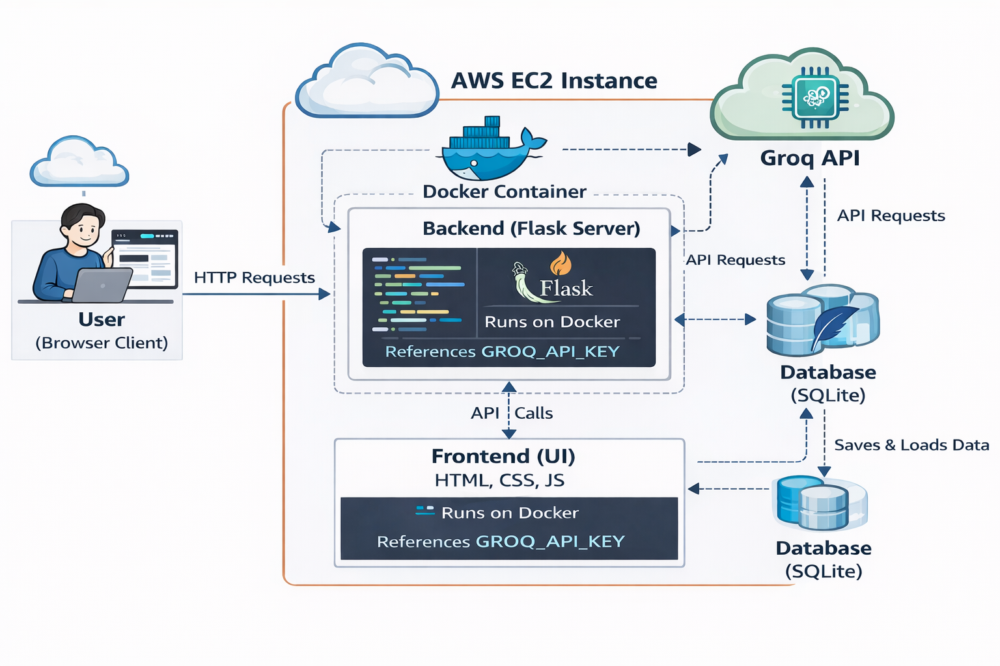
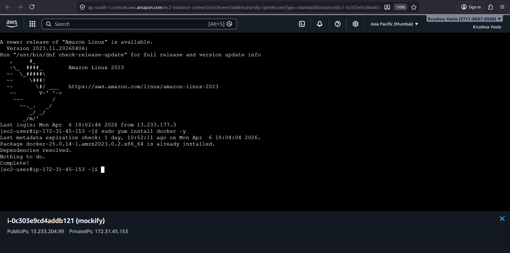
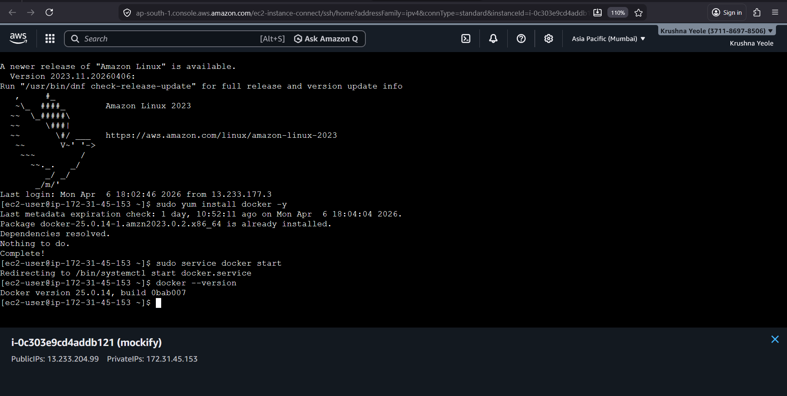
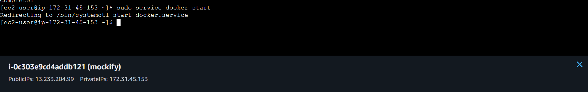
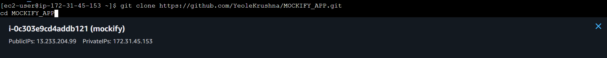
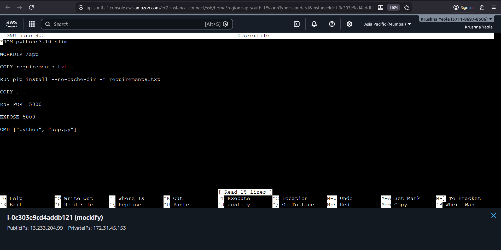
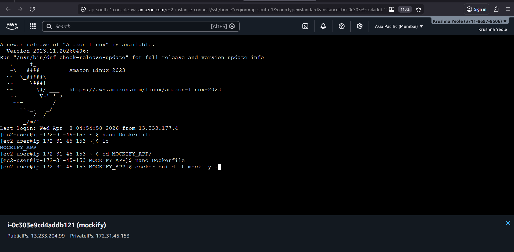
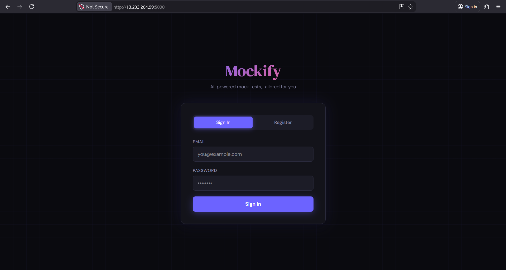
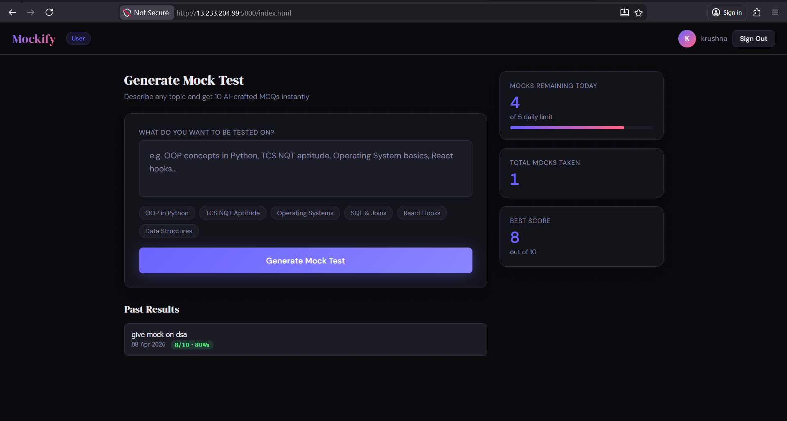

# Mockify: AI-Powered Mock Test Platform 🚀

**Containerized Deployment using Docker and AWS EC2**

## 📖 Introduction
**Mockify** is an AI-powered mock test web application designed to help users practice any topic instantly. 
* **Tech Stack:** Developed using Flask (Backend), HTML, CSS, and JavaScript (Frontend) for full-stack web development.
* **Core Functionality:** Allows users to generate, attempt, and analyze MCQ-based tests in a structured, personalized way.
* **Infrastructure:** Focuses on a containerized deployment approach using Docker for consistency and portability, hosted on an AWS EC2 instance.

## ⚠️ Problem Statement
In traditional systems, generating and practicing topic-specific tests is often manual and time-consuming. Users rely on static question banks, which lack flexibility and personalization. Additionally, deploying full-stack applications manually can lead to configuration issues, inconsistencies, and errors. Managing dependencies and environment setup across systems becomes difficult without proper standardization. 

There is a distinct need for an intelligent system that can generate dynamic tests, paired with a deployment approach that ensures consistency, scalability, and efficiency.

---

## 🏗️ System Architecture

### Architecture Flow:
1. **User Request:** The user accesses the application through their web browser.
2. **Frontend to Backend:** The frontend sends HTTP API requests to the Flask backend running inside a Docker Container on AWS EC2.
3. **Logic Processing:** The backend processes the request and handles the core application logic.
4. **AI Generation:** The backend calls the **Groq API** to dynamically generate multiple-choice questions (MCQs) based on the user's prompt.
5. **Data Handling:** The Groq API returns the generated questions, which the backend then stores in a local **SQLite Database**. Data is also retrieved from this DB for user history.
6. **Response:** The backend sends the structured response back to the frontend.
7. **Display:** The frontend renders the dynamic UI, displaying the test or results to the user.

---

## 🛠️ Implementation & Deployment Guide

The following steps detail the end-to-end deployment of Mockify on AWS using Docker.

### Step 1: AWS EC2 Provisioning & Security Groups
First, an AWS EC2 instance is launched. To allow web traffic and SSH access, inbound rules are configured in the Security Group.

* **Ports Opened:** * `22` (SSH) for terminal access.
  * `80` (HTTP) and `443` (HTTPS) for standard web traffic.
  * `5000` (Custom TCP) specifically exposed for the Flask application.

### Step 2: Installing Docker on EC2
Using EC2 Instance Connect, we access the terminal and install Docker to containerize our application.

* Command used: `sudo yum install docker -y`

Once installed, the Docker service is started to allow container execution.

* Command used: `sudo service docker start`

We verify the installation by checking the Docker version.

* Command used: `docker --version` (Running version 25.0.14).

### Step 3: Cloning the Repository
The source code is pulled directly from GitHub onto the EC2 instance.

* Command used: `git clone https://github.com/YeoleKrushna/MOCKIFY_APP.git`
* Navigated into the directory using `cd MOCKIFY_APP`.

### Step 4: Configuring the Dockerfile
To ensure the application runs consistently, a `Dockerfile` is used to define the environment. 

* The image uses `python:3.10-slim`.
* It installs dependencies from `requirements.txt`.
* Exposes port `5000` and sets the command to run `app.py`.

### Step 5: Building the Docker Image
With the environment defined, the Docker image is built locally on the EC2 instance.

* Command used: `docker build -t mockify .`
* *(Note: Environment variables, such as API keys, are configured using a `.env` file prior to running the container).*

### Step 6: Application Access & UI
Once the container is running and port mapping is established, the application is live and accessible via the EC2 instance's Public IP address on port `5000`.

**Sign-In Page:**

* Users are greeted with a clean, responsive authentication page to secure their personalized test data.

**User Dashboard:**

* Users can input custom topics (e.g., "OOP in Python", "Data Structures") to generate instant 10-question MCQs.
* The dashboard tracks daily mock limits, total mocks taken, best scores, and provides a history of past results.

---

## 🎯 Applications & Use Cases
* **Students:** For targeted, topic-wise practice tests.
* **Job Seekers:** Helps in preparing for aptitude and technical exams (e.g., TCS NQT, Software Engineering interviews).
* **Quick Revision:** Highly useful for rapid assessment before exams or interviews.
* **Educational Institutions:** Can be utilized in colleges for quick, dynamic mock assessments.
* **Self-Learning:** Supports independent study through instant feedback and result analysis.
* **E-Learning Platforms:** Applicable as an integrable tool within larger online test and education systems.